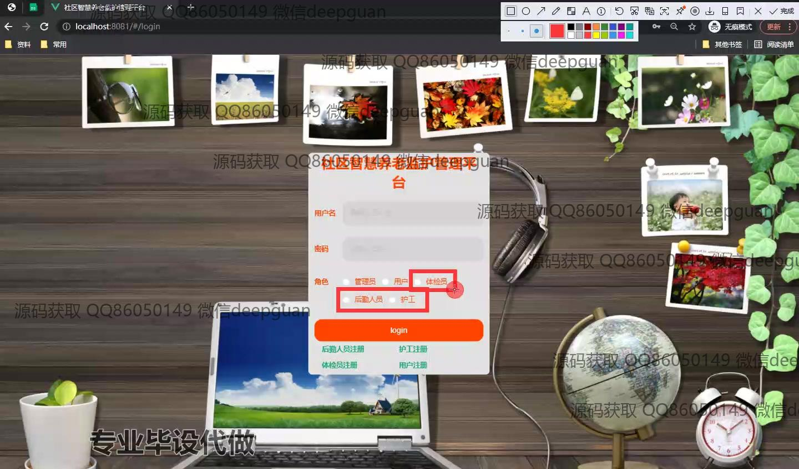

<h1 align="center">社区智慧养老监护管理平台设计与实现</h1>

## 简介
社区智慧养老监护管理平台：角色分为管理员、用户、医生、护工；功能包括老人信息管理、房间信息管理、反馈信息管理、物资申请管理、用户角色管理，致力于提升养老社区管理效率和服务质量。    --计算机毕业设计源码；毕设源码；java毕业设计源码

## 联系方式

<h3 align="center">获取完整代码与数据库文件 + 微信：deepguan QQ: 86050149 QQ群: 783742310</h3>

<h3 align="center">可帮忙远程部署 包运行成功！提供远程部署、修改代码、设计文档指导、代码讲解等服务！</h3>

## 功能介绍（完整见运行截图）
管理员：基本功能包括登录、注册、退出，以及管理社区智慧养老平台的各类信息，涵盖用户管理、房间信息管理、物资申请和反馈信息管理等模块。管理员可以查看和操作详细信息，比如新增、修改、删除用户信息和反馈信息，管理老人的入住信息和健康状态，并保持后台系统的正常运行。通过导航栏快速访问各个模块，有助于高效管理和提高社区养老服务的整体运营效率。

用户：在平台中，用户主要功能包括登录、注册，查看社区养老服务相关信息，如房间类型和床位信息，老人信息及其健康状态等。他们可以通过系统界面执行查询、过滤操作，查看反馈信息，提交物资申请，并在需要时进行信息更新。用户也有权限管理自己的个人信息，包括联系方式、账号设置等，确保系统内的所有个人数据保持准确和及时更新。

医护人员：医护人员在智慧养老监护管理平台上的功能包括登录、注册、查看老人的健康信息和体检记录，管理物资申请和分配，确保医疗物资和服务的及时供应。他们可以通过平台提交紧急医疗请求，查看和记录老人每日健康报告，并通过导航栏实时访问健康数据、体检情况，保障老人的医疗服务和安全健康。

后勤人员：后勤人员的功能主要涉及登录、注册，管理和维护养老社区的后勤事务。平台提供了物品管理、房间信息更新、反馈信息传递等功能。他们负责日常物资的申请和分配，确保社区设施和资源的高效运转。后勤人员使用平台查找和更新房间状态和物资库存，通过快速有效的操作平台，支持整体养老服务的及时性和精确性。

## 运行截图

本代码来源于网络,仅供学习参考使用!

